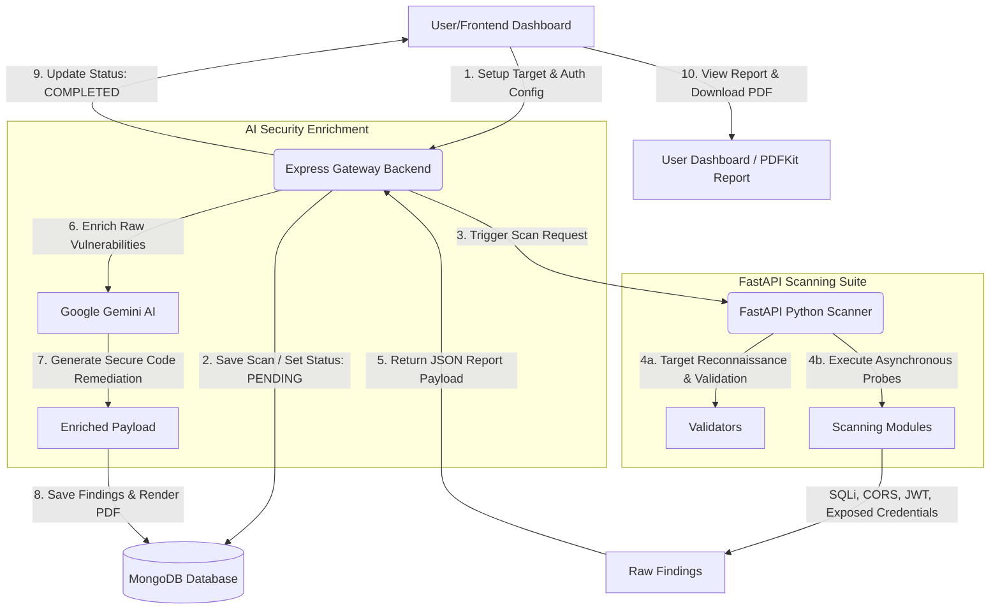

# API Auditor 🛡️
### Automated REST API Security Assessment Platform

[](https://nextjs.org/)
[](https://www.typescriptlang.org/)
[](https://nodejs.org/)
[](https://expressjs.com/)
[](https://fastapi.tiangolo.com/)
[](https://www.mongodb.com/)
[](https://deepmind.google/technologies/gemini/)
[](https://render.com/)

---

## 1. Project Title
**API Auditor** — An automated REST API security assessment platform designed to identify vulnerabilities, map exploits to industry standards, and deliver AI-driven patches.

---

## 2. Overview
API Auditor is a web application that helps developers secure their REST APIs. It runs high-speed, asynchronous security probes against target endpoints and integrates with **Google Gemini AI** to provide developer-friendly explanations, risk impact assessments, and secure code remediations.

Analyze APIs for security misconfigurations, generate detailed reports, map findings to OWASP API Top 10 & CWE, and receive AI-powered remediation.

---

## 3. Key Features ⭐
* **Asynchronous Scanner**: Built with Python asyncio & aiohttp to run parallel security checks in seconds.
* **AI-Enriched Remediation**: Explains the impact of vulnerabilities and provides tailored code patches.
* **Interactive Dashboard**: Track multiple target APIs, monitor security scores, and review scan history.
* **Secure JWT Session Guard**: Sign-up and log-in options backed by JWT access tokens.
* **Automated PDF Reports**: Exporter that packages scorecards and code fixes into print-ready PDF audits.
* **Flexible Scanning Configuration**: Supports custom headers, Bearer tokens, and OpenAPI specifications.

---

## 4. Architecture
API Auditor uses a multi-tier microservices architecture to segregate presentation, orchestration, scanning, and intelligence:

```
+------------------+      HTTPS / JSON      +---------------------+
|                  | ---------------------> |                     |
|  Next.js Client  |                        |   Express Gateway   |
|   (TypeScript)   | <--------------------- |    (Orchestrator)   |
|                  |      JWT Authed        |                     |
+------------------+                        +---------------------+
                                                       |
                                                       | Proxy Request
                                                       v
+------------------+     Asynchronous HTTP  +---------------------+
|                  | <--------------------- |                     |
|    Target API    |                        |   FastAPI Engine    |
|   (Under Test)   | ---------------------> |   (Python Scanner)  |
|                  |       Responses        |                     |
+------------------+                        +---------------------+
                                                       |
                                                       | MongoDB
                                                       v
                                            +---------------------+
                                            |                     |
                                            |   Google Gemini AI  |
                                            | (Threat Intelligence)
                                            +---------------------+
```

---

## 5. Tech Stack
* **Frontend**: Next.js 14, TypeScript, Tailwind CSS, Lucide Icons, Axios.
* **Backend Gateway**: Node.js, Express, TypeScript, Mongoose, PDFKit, Swagger UI.
* **Scanner Engine**: Python 3.10+, FastAPI, Uvicorn, aiohttp, asyncio.
* **Database**: MongoDB (Mongoose ODM).
* **AI Engine**: Google Gemini AI (via `@google/generative-ai` SDK).

---

## 6. Screenshots
*(Coming soon)*

---

## 7. Live Deployment
* **Frontend Application**: [https://api-security-scanner-5b02.onrender.com](https://api-security-scanner-5b02.onrender.com)
* **Backend Gateway**: [https://api-security-scanner-backend.onrender.com](https://api-security-scanner-backend.onrender.com)
* **FastAPI Scanner Service**: [https://api-security-scanner-fastapi.onrender.com/](https://api-security-scanner-fastapi.onrender.com/)

---

## 8. Installation
Ensure you have **Node.js (v18+)**, **Python (3.9+)**, and a running instance of **MongoDB** locally.

### Backend Setup
1. Open terminal and navigate to the backend directory:
   ```bash
   cd backend
   ```
2. Install Node dependencies:
   ```bash
   npm install
   ```

### Scanner Setup
1. Open terminal and navigate to the scanner directory:
   ```bash
   cd scanner
   ```
2. Create and activate a Python virtual environment:
   ```bash
   python -m venv venv
   # On Windows:
   .\venv\Scripts\activate
   # On macOS/Linux:
   source venv/bin/activate
   ```
3. Install required libraries:
   ```bash
   pip install -r requirements.txt
   ```

### Frontend Setup
1. Open terminal and navigate to the frontend directory:
   ```bash
   cd frontend
   ```
2. Install npm dependencies:
   ```bash
   npm install
   ```

---

## 9. Environment Variables
Create `.env` files in respective folders.

### Backend Env (`backend/.env`)
```env
PORT=5000
NODE_ENV=development
MONGO_URI=mongodb://localhost:27017/api_sentinel
JWT_SECRET=your_jwt_secret_key_here
FRONTEND_URL=http://localhost:3000
GEMINI_API_KEY=your_gemini_api_key_here
```

### Frontend Env (`frontend/.env.local` or equivalent)
```env
NEXT_PUBLIC_API_URL=http://localhost:5000
```

---

## 10. Local Setup
Follow these steps to run all three services concurrently in development mode:

1. **Start MongoDB**: Ensure MongoDB is running on `mongodb://localhost:27017/`.
2. **Start Backend Gateway**:
   ```bash
   cd backend
   npm run dev
   ```
   *Runs on `http://localhost:5000` (API Docs available at `/api/docs`)*
3. **Start FastAPI Scanner**:
   ```bash
   cd scanner
   # Activate virtualenv first
   uvicorn app:app --reload
   ```
   *Runs on `http://localhost:8000`*
4. **Start Next.js Frontend**:
   ```bash
   cd frontend
   npm run dev
   ```
   *Runs on `http://localhost:3000`*

---

## 11. Usage
1. **Register & Log In**: Access the frontend dashboard and create an account.
2. **Configure Scan Target**:
   * Input the target API's URL (e.g. `https://jsonplaceholder.typicode.com`).
   * Select optional Auth Config (Bearer Token, Basic Auth, custom headers).
   * (Optional) Paste an OpenAPI Specification JSON.
3. **Run Scan**: Click **Start Scan** to trigger the assessment.
4. **Inspect Findings**: Once complete, view the score card, expand vulnerability rows to inspect Gemini AI-generated remediation patches, and click **Download PDF Report**.

---

## 12. Project Workflow
The scanning process follows a sequential workflow:



---

## 13. Security Checks
API Auditor executes a wide array of specialized test modules against target endpoints:

* **Transport Layer Security**: Verifies if HTTPS is enforced and detects plaintext fallback.
* **HTTP Security Headers**: Checks for standard security-related headers (`Content-Security-Policy`, `Strict-Transport-Security`, `X-Frame-Options`, `X-Content-Type-Options`).
* **SQL Injection (SQLi)**: Sends active escape payloads and time-delay commands to detect database error disclosures.
* **Broken JWT Validation**: Analyzes token acceptance rules against weak keys or signature bypasses (`none` algorithm).
* **Excessive Data Exposure**: Evaluates response bodies against patterns matching API keys, credentials, private keys, and environment files.
* **CORS Policies**: Inspects origin reflections to detect wildcard (`*`) trust setups.
* **Rate Limiting Checks**: Simulates heavy requests to verify if HTTP 429 Throttle status is returned.
* **Framework & Server Fingerprinting**: Analyzes response signatures to identify server types (Nginx, Apache) and framework runtimes.

---

## 14. OWASP & CWE Mapping
Vulnerabilities detected by the scanning engine are automatically categorized under the corresponding **OWASP API Security Top 10** risks and **Common Weakness Enumeration (CWE)**:

| Security Check | OWASP API Top 10 (2023) | CWE Identifier |
| :--- | :--- | :--- |
| **SQL Injection (SQLi)** | API10:2023 Unsafe Consumption of APIs | CWE-89 (Improper Neutralization of Special Elements) |
| **Broken JWT Authentication** | API2:2023 Broken Authentication | CWE-287 (Improper Authentication) |
| **Excessive Data Exposure** | API3:2023 Broken Object Property Level Authorization | CWE-200 (Exposure of Sensitive Information) |
| **CORS Wildcard Policy** | API8:2023 Security Misconfiguration | CWE-942 (Permissive CORS Policy) |
| **Missing Security Headers** | API8:2023 Security Misconfiguration | CWE-693 (Protection Mechanism Failure) |
| **Unenforced HTTPS (TLS)** | API8:2023 Security Misconfiguration | CWE-319 (Cleartext Transmission of Sensitive Data) |
| **No Rate Limiting** | API4:2023 Unrestricted Resource Consumption | CWE-770 (Allocation of Resources Without Limits) |

---

## 15. AI Remediation
API Auditor integrates Google Gemini AI to translate raw vulnerability logs into developer-focused recommendations:

- **Google Gemini integration**: Directly invokes generative AI models using the official `@google/generative-ai` package.
- **Context-aware vulnerability explanations**: Formulates an explanation based on the specific endpoint, request parameters, and response headers.
- **Secure code recommendations**: Produces copy-pasteable, secure refactored code blocks for major stacks (Express, Python, Next.js) to resolve the issue.
- **OWASP API Top 10 & CWE-aware remediation**: Enriches findings with structural details on how to prevent recurrent security failures.

---

## 16. Sample PDF Report
API Auditor generates visual, print-ready security assessment documents. Using `PDFKit` on the backend, it structures a dashboard layout containing:
* Overall Security Score indicator.
* Card-based vulnerability count grouped by severity (High, Medium, Low, Info).
* Structured table of target endpoints scanned.
* Itemized review of each finding, alongside developer descriptions, severity classifications, and Gemini-generated code fixes.

---

## 17. Key Engineering Highlights
* **Full-stack REST API security assessment platform**: Engineered a 5-tier microservices architecture separating Node.js/Express orchestration from Python/FastAPI scanning engine.
* **AI-powered remediation using Google Gemini**: Integrated LLM analysis pipelines to parse raw security vulnerabilities and generate copy-pasteable refactored code fixes.
* **OWASP API Top 10 & CWE mapping**: Designed a structured mapping system to link custom scanning checks to standard security taxonomy.
* **Automated PDF report generation**: Programmed backend rendering engines using PDFKit to generate audit documents containing scorecard metrics and code changes.
* **Technology fingerprinting**: Built reconnaissance engines that inspect HTTP headers and response signatures to identify active runtime environments and server versions.
* **JWT-based authentication**: Implemented session token management to secure resource dashboards and isolate user test targets.
* **MongoDB Atlas integration**: Configured mongoose schemas to log targets, compare posture drift, and cache scan summaries.
* **Cloud deployment using Render**: Deployed and configured the multi-container stack with environment variables and cross-origin controls.

---

## 18. Deployment Notes
* **Render Free-Tier Cold Start**: The Frontend, Backend, and Scanner services are hosted on Render's free tier. If the application has been inactive, the containers spin down. **Please allow 30–40 seconds** for the services to wake up when making the first request or starting a scan.

---

## 19. Future Enhancements
* **OpenAPI File Upload**: Allow users to drag-and-drop an `openapi.json` file to auto-configure route trees for comprehensive path scanning.
* **Redis/BullMQ Task Queue**: Offload scanning pipelines to a background queue to handle longer scanner executions without timeouts.
* **WebSockets Logs Integration**: Stream real-time scanner logs (Socket.io) to the frontend console as checks execute.
* **Broken Object-Level Authorization (BOLA/BFLA) Probing**: Add stateful checks to query endpoints using varying resource identifiers.

---

## 20. Known Limitations
* **REST API Focus**: The current version only audits standard REST endpoints (GraphQL, gRPC, and SOAP protocols are not supported).
* **Parallel Request Cap**: Limits maximum targets to 10 endpoints per scanned scope to prevent triggering rate-limits on target endpoints.

---

## 21. License
Distributed under the MIT License. See `LICENSE` for more details.

---

## 22. Author
* **GitHub**: [pradeep-git-dev](https://github.com/pradeep-git-dev)
* **Email**: narupradeep001@gmail.com
* **Repository Link**: [https://github.com/pradeep-git-dev/API-Security-Scanner](https://github.com/pradeep-git-dev/API-Security-Scanner)

---

## 23. References
* [OWASP API Security Top 10](https://owasp.org/www-project-api-security/)
* [FastAPI Documentation](https://fastapi.tiangolo.com/)
* [Express JS Framework](https://expressjs.com/)
* [Next.js Web SDK](https://nextjs.org/)
* [Google AI Studio (Gemini API)](https://ai.google.dev/)
* [PDFKit Reference Manual](https://pdfkit.org/)
